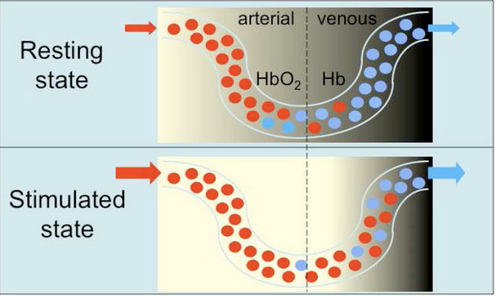

## fMRI: A Reproducibility Disaster?
fMRI is a technique that uses MRI to detect brain activity associated with blood flow. It is often used in psychological and neuroscientific studies to detect changes in areas of the brain, in an effort to determine what parts of the brain are responsible for distinct actions. It was developed in 1991 and had a great surge in popularity due to its ease of use and promised results. fMRI had a high degree of spatial resolution and was very easy for clinicians to use because it only needed a 1.5T magnetic field. However in recent years, studies have shown that fMRI may be overused in the neuroscientific community due to its many problems, chief among them, its reproducibility issues. While fMRI definitely has its uses, the problems it faces with replicability and bad software packages warrant caution when using it in a research capacity.  

To understand the limitations of fMRI, it is first important to understand the physical and biological basis of fMRI. Regular MRI works by using a strong electromagnet that creates a magnetic field which generates pulses of energy. This energy is then absorbed by water molecules in the body at specific frequencies, which are then detected and turned into an image. In fMRI, the process is similar but different contrast methods are used, and is repeated many times to create a functional image. fMRI uses the principle that increased neural activity means increased blood flow in the area of the brain where that activity took place. This, in turn, changes the concentration of oxygenated and deoxygenated hemoglobin in that part of the brain (Glover). Oxygenated and deoxygenated hemoglobin respond differently in magnetic fields, allowing it to be tracked by fMRI. When fully oxygenated, hemoglobin is diamagnetic and is magnetically unrecognizable from surrounding brain tissue (Glover). However, deoxygenated hemoglobin has four unpaired valence electrons making it highly paramagnetic. The paramagnetic properties of deoxygenated hemoglobin allow for gradients in the magnetic field intensity which can then be utilized to create an image. Other types of fMRI contrast exist, but they require a contrast agent to be applied in order to track brain blood flow (Glover). Since using hemoglobin oxygenation is non-invasive, it is the most prevalent type of fMRI contrast.

​

**Figure 1**: This figure demonstrates how the concentration of oxygenated (red) and deoxygenated (blue) hemoglobin changes in the brain. As the brain is stimulated, oxygenated hemoglobin becomes more prevalent, and the decreasing levels of deoxygenated hemoglobin can be used as contrast for fMRI (Glover).

The typical fMRI experiment involves a researcher measuring initial brain activity of the participant. The researcher then gives the participant some stimulus, and monitors the brain. When an area of the brain “lights up”, theoretically, that part of the brain is responsible for that stimulus. For example, a study in 2013 used fMRI to demonstrate that the amygdala is stimulated when people view emotional faces as opposed to geometric shapes (Barch). Thus researchers can assume that the amygdala is responsible for some of the neural activity when viewing these emotional faces. fMRI allowed many psychologists and neurologists to make tangible, concrete claims about emotions and what parts of the brain were responsible for them. 
However this methodology is flawed and has many limitations. One very simple limitation is that for fMRI to work, the participant must lie as still as possible, as lots of head motion hinders reading. Some head motion can be compensated for, using software, however this software is not always accurate. Another limitation is that in fMRI there exists a time lag. As the last image of the brain is taken a couple seconds after the first slice, calculations must be done to compensate and make the image appear as it did at the time the first slice was taken. These calculations are not perfect, and require humans to manually compensate. Along the same themes of the previous two flaws, the actual software packages used to analyze fMRI contrast and fMRI images can be seriously flawed. In a paper published in 2016, Eklund et al. showed that the most common fMRI software analysis packages have a false positive rate of 70%. This was because there were spatial autocorrelation functions that did not follow a Gaussian shape. These spatial autocorrelation functions help smooth out voxel data, but they must follow certain statistical parameters that many software packages neglected, resulting in tens of thousands of papers that utilized fMRI and these packages to be invalidated.
While the previous software issue was eventually fixed, there exists a deeper problem at the heart of fMRI research. When researchers have attempted to reproduce fMRI results, they are not able to do so. As reproducibility is one of the key tenets of good scientific research, being unable to do so with fMRI signals some flaw with its application. A study published in 2020 suggested that fMRI research for use as a brain biomarker was not reproducible nor reliable (Elliot). They suggested this because brains differ from one individual to another, and these individual differences in the brain do not simply constitute different areas of brian activation. Since many of these studies use small sample sizes, they suffered from this limitation.

This does not mean that fMRI is completely obsolete. Multiple papers have come out showing a link between increased sample size and increased reproducibility results (Turner). A study by Bossier actually demonstrated that reproducibility in fMRI is actually a function of sample size. Intuitively this makes sense, as increasing the amount of brains scanned averages out the unique differences in each participant’s brains when exposed to the same stimulus. Overall, fMRI is a good tool to use in conjunction with other imaging techniques and should not be used to make large claims, especially when small sample sizes are used. It also serves as a cautionary tale to all scientists to not take third party software packages as infallible, to use large sample sizes when possible, and to not make general claims when only using a small data set as evidence.

### References

Barch, D. M., Burgess, G. C., Harms, M. P., Petersen, S. E., Schlaggar, B. L., Corbetta, M. . . . 
WU-Minn HCP Consortium . (2013). Function in the human connectome: Task-fMRI 
and individual differences in behavior. NeuroImage, 80, 169–189. 

Bossier, H., Roels, S. P., Seurinck, R., Banaschewski, T., Barker, G. J., Bokde, A. L. W., 
Quinlan, E. B., Moerkerke, B. (2020). The empirical replicability of task-based fMRI as a function of sample size. In NeuroImage (Vol. 212, p. 116601). Elsevier BV. https://doi.org/10.1016/j.neuroimage.2020.116601

Eklund, A., Nichols, T. E., & Knutsson, H. (2016). Cluster failure: Why fMRI inferences for 
spatial extent have inflated false-positive rates. In Proceedings of the National Academy of Sciences (Vol. 113, Issue 28, pp. 7900–7905). Proceedings of the National Academy of Sciences. https://doi.org/10.1073/pnas.1602413113

Elliott, M. L., Knodt, (2020). What Is the Test-Retest Reliability of Common Task-Functional 
MRI Measures? New Empirical Evidence and a Meta-Analysis. In Psychological Science (Vol. 31, Issue 7, pp. 792–806). SAGE Publications. https://doi.org/10.1177/0956797620916786

Glover GH. Overview of functional magnetic resonance imaging. Neurosurg Clin N Am. 
2011;22(2):133-vii. doi:10.1016/j.nec.2010.11.001

Horster, I., Nickel, K., Holovics, L., Schmidt, S., Endres, D., Tebartz van Elst, L., Zeeck, A., 
Maier, S., & Joos, A. (2020). A Neglected Topic in Neuroscience: Replicability of fMRI Results With Specific Reference to ANOREXIA NERVOSA. Frontiers in psychiatry, 11, 777. https://doi.org/10.3389/fpsyt.2020.00777

Nee, D.E. fMRI replicability depends upon sufficient individual-level data. Commun Biol 2, 130 
(2019). https://doi.org/10.1038/s42003-019-0378-6

Szucs, D., & Ioannidis, J. P. A. (2017). Empirical assessment of published effect sizes and power 
in the recent cognitive neuroscience and psychology literature. In E.-J. Wagenmakers 
(Ed.), PLOS Biology (Vol. 15, Issue 3, p. e2000797). Public Library of Science (PLoS). 
https://doi.org/10.1371/journal.pbio.2000797 

Turner, B.O., Paul, E.J., Miller, M.B. et al. Small sample sizes reduce the replicability of 
task-based fMRI studies. Commun Biol 1, 62 (2018). https://doi.org/10.1038/s42003-018-0073-z

 

*Originally written 2022.04.18*