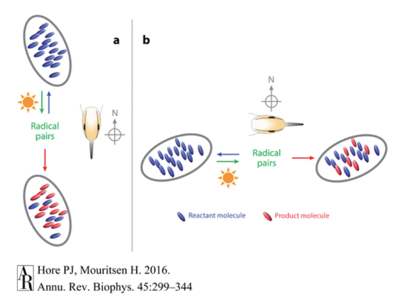
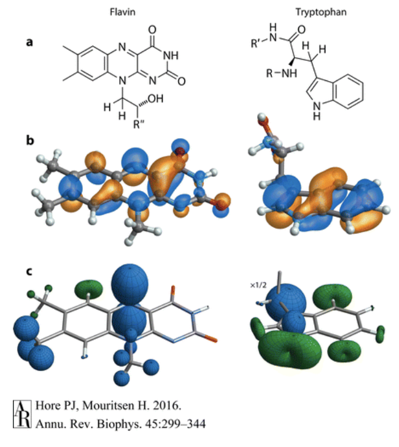
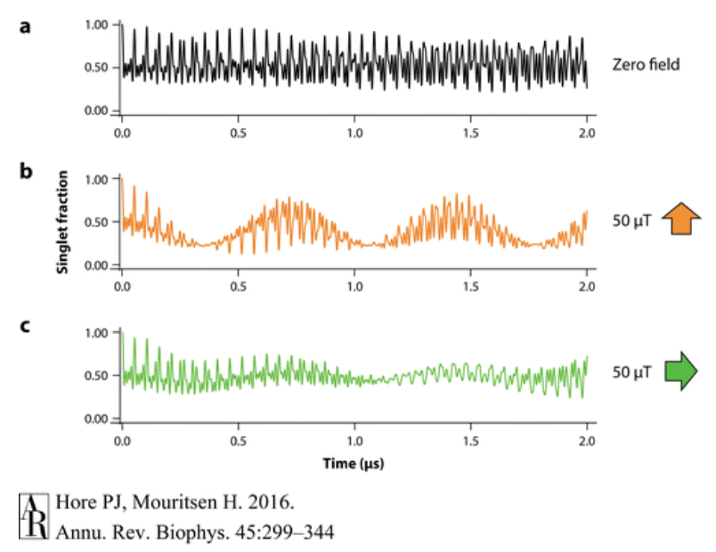
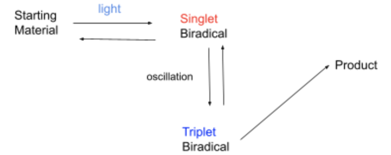

<head>
<!-- Google tag (gtag.js) -->

</head>
## Competing Hypotheses for Magnetoreception in Migratory Birds

### Abstract
This paper examines two competing hypotheses for magnetoreception in migratory birds: the quantum radical pair mechanism hypothesis and a classical magnetite particles hypothesis. The radical pair mechanism uses high energy light to excite an electron on a light sensitive protein on a bird’s eye called a cryptochrome. This causes the formation of a radical pair of molecules, which either form a new molecule or revert back to the starting material, depending on the strength and orientation of an external magnetic field. The ratio of starting material to product is used to signal the bird’s direction relative to the magnetic field. The magnetite particle hypothesis suggests that small magnetic particles in the bird’s beak align and are connected to ion channels providing signal transduction for the bird’s magnetoreception. Recent evidence has increased the support of the radical pair theory, but there is yet to be a definite clear explanation.

### Introduction
It has been known for some time that some birds utilize Earth’s magnetic field to navigate from location to location. Homing pigeons are famous for their ability to return to their home over periods of long distances, aided by Earth’s own magnetic field. However the mechanism for this magnetoreception has long been disputed. Not only would the bird need to be able to detect Earth’s magnetic field, but they would also need to recognize the difference between its direction. In essence, the bird requires a biological compass. There are two major hypotheses that attempt to explain the magnetoreception phenomenon. The first is an explanation using small magnetic particles in the bird’s beak that either align or repel themselves depending on the bird’s orientation relative to the Earth’s magnetic field, allowing magnetic signal transduction. The second hypothesis is called the radical pair mechanism and involves photosensitive receptors in the birds retinas that accept high energy light, and create radicals which change in concentration according to orientation and alignment of a magnetic field, generating a way for birds to know their direction. Over the past two decades, the radical mechanism has become the predominant hypothesis for magentorecption, and has garnered very promising experimental evidence.

### Radical Pair Mechanism

The basis of the radical pair mechanism is that there exists a chemical reaction in the bird that produces molecules that are affected by Earth’s magnetic fields. In this reaction, the starting molecules are excited by light and are converted to the short-lived radical pairs and then are either converted to a product molecule, or revert back to the original starting molecule. Thus there constantly exists a ratio of product molecules to starting molecules. One of the key points of this reaction is that it is both sensitive to a magnetic field and light (which is needed to excite the reaction). This idea was first proposed by Klaus Schulten in 1978, who had previously demonstrated that mechanisms that produce radical pairs are often affected by weak magnetic fields. Because this reaction is affected by a weak magnetic field, when a bird changes direction, the ratio of product molecules to starting molecules also changes, which is sensed by the bird (Hore). The Earth’s magnetic field being able to impact such small molecules seems thermodynamically implausible. However radical pairs exist in very high non-equilibrium states and are extremely unstable causing the magnetic field to have a great impact.  

​

To further understand the radical pair mechanism, it is first important to understand what radicals are, as well as their quantum and magnetic properties. A radical is an atom with an odd number of valence electrons, causing one electron to be unpaired. When two radicals are created simultaneously, it is called a radical pair. Due to electrons having spin and magnetic moment, the radicals are also magnetic (Hore). The unpaired electrons also give rise to other properties in the radical pair. If the electrons have opposite spins (anti-parallel), the total spin would cancel out, giving a total spin of 0, and the radical pair would be said to be in a singlet state. However, if the two unpaired electrons have the same spins (parallel), the total spin becomes 1, and the radical pair is in the triplet state (Hore)(Wiltschko). One way to form a radical pair is to shine light on a molecule, exciting one electron, transferring it from one closed shell to another: AB --->(light) A+B- (Hore). These types of reactions conserve spin, and thus conserve the state of the radical products. Since the molecule was originally in the singlet state (as most non-radical molecules are), A and B are also in the singlet state.  

​
 
Many organic molecules also contain atomic nuclei that have spin and thus have magnetic properties. Molecules that contain 1H and 14N have nuclear spin, and the spins of these nuclei interact with the electronic spins leads to a property called hyperfine interactions. In most radicals, the unpaired electron is delocalized, meaning that it exists over multiple areas of the molecule. Thus, the hyperfine interactions between the nucleus of the atom and the unpaired electron also exist in many parts of the molecule. These interactions are anisotropic, meaning that for the same interaction between the electron and the spinning nucleus, the strength of the interaction changes depending where the electron is. In Figure C, the hyperfine interactions of two radical molecules (Flavin and Tryptophan) are shown, and the anisotropic effect is seen clearly. In the top nitrogen of the middle ring, the strength of the interaction changes greatly depending on the plane of the electron, giving rise to the balloon shape. These anisotropic interactions yield directional information in the radical pair mechanism, and is why at least one hyperfine interaction is needed in the radical pair mechanism (Hore).  

The hyperfine interactions between the nucleus and the electron can cause the electron’s spin to switch and oscillate, thus changing the molecule from a singlet state to a triplet state. These oscillations are due to the energy differences in the hyperfine interactions, which also determines the frequency of the oscillations as frequency and energy are related through: E=hf. Introducing a magnetic field to the radical pair, changes the frequency of the oscillation between the two states, as it changes the energy. Introducing a rotated magnetic field, as seen in Figure C, changes the frequency of oscillation again because since the hyperfine interactions are anisotropic, the direction of the magnetic field impacts it greatly. The strength of the magnetic field introduced, 50 µT, is comparable to that of Earth’s own magnetic field, and the figure above demonstrates how such a magnetic field can impact the fraction of singlet radicals compared to triplet radicals, and starts to prelude how a bird might be able to detect direction using the radical pair mechanism (Hore).  

​

As seen above, the presence and direction of the magnetic field changes the proportion of the singlet radical pair to the triplet radical pair. Since radical pairs are unstable, they tend to not stay in the radical form and form products quickly (Hore). The singlet radical pair will revert back to the starting material, and the triplet radical pair will form a new triplet product. Thus the magnetic field not only changes the ratio of radicals, but actually changes the ratio of products as well. If a magnetic field is applied which limits the fraction of singlet radical pairs, one can expect an increase in the product molecule. Conversely, if the fraction of triplet radicals is low, an increase in the starting material will be seen (Hore). Thus a bird might be able to detect the differing concentrations of starting material or product, and sense their direction based on their alignment of Earth’s magnetic field favoring one radical state over another.  

​

When the radical pair mechanism was introduced in 1978, it was deemed interesting, but not of great significance because there was no biological basis for it in birds. However, in 2000, Schulten proposed a new protein called cryptochrome was suggested to be responsible for the radical pair mechanism because it was proven to be able to become a radical pair when exposed to light. Cryptochromes accept high energy visible light such as blue and green light, to start the reaction by producing the radicals (Hore). A cryptochrome molecule contains one flavin adenine nucleotide (FAD) residue and three tryptophan residues. When the flavin molecule accepts the blue light particle, it triggers a cascade of electron transfers along the three other tryptophans, with the first tryptophan donating an electron to the FAD, the second tryptophan donating an electron to the first, the third donating an electron to the second, ending with the third tryptophan becoming more positively charged, and the FAD becoming more negatively charged producing a radical.

### Magnetite Particles
An alternative hypothesis to the radical mechanism is that magnetite (Fe3O4) particles in the bird’s beak are responsible for their magnetoreception. This hypothesis is not quantum based and relies on the inherent magnetic properties of magnetite. The strength of the magnetite particles is dependent on their size and shape. Superparamagnetic particles are smaller than 40 nm. Superparamagnetic particles interact magnetically with each other, but the crystals are not big enough for a permanent magnetic moment. Single domain magnetite crystals are big and strong enough to produce permanent magnets when all the magnetite crystals are aligned (Hore). Multi-domain crystals are too big to align together, even though their individual magnetic moments are stronger than that of single domain particles. Their magnetic fields end up canceling each other out, rather than aligning together. The case for magnetite particles is also supported by the existence of magnetotactic bacteria. Magnetotactic bacteria use magnetite particles that align themselves with Earth’s magnetic field. There are tiny particles that connect and align themselves, not unlike a compass. The bacteria are able to use this to orient themselves, and know which way is up and down. In the bird’s case, it is theorized that the magnetic particles are linked to ion channels, and that when the particles are aligned and parallel to the magnetic, the ion channel is closed; and when the particles are perpendicular to the magnetic field, the ion channels are open. This mechanism allows for signal transduction of the magnetic mechanism.  

### Radical Pair Evidence
The cryptochrome radical reaction has been shown experimentally to work, and thus could theoretically explain the mechanism of magnetoreception in birds. But biological research whether it is occuring in birds is still ongoing. However there is a lot of experimental evidence that supports the radical pair mechanism. It is theorized that the cryptochromes exist in the retinas of the birds, allowing light to easily enter. One behavioral experiment done in 1993 by Drs. Wolfgang and Roswitha Wiltschko showed that when given white, blue, and green light, birds would fly in the direction of an artificially induced magnetic field, even when the field direction was flipped (Wiltschko). However, when the birds were given orange and yellow light, they began flying in random directions. This seems to support the radical pair mechanism, as high energy light is needed to excite electrons, while low energy light is not powerful enough. Further, if the magnetoreception was due to magnetic particles instead of the radical pair mechanism, they theoretically should not be affected by any type of light, as it is not needed for an aligning magnetic field. It was also discovered that cryptochromes exist in the ganglion layer of the eyes of migratory birds, further giving credence to the radical pair mechanism. These cryptochromes were also found to produce long-lasting radicals, which is necessary as short lived radicals do not have enough time to oscillate and form a varying concentration of starting material and product. While these types of evidence do not definitely prove the radical pair mechanism, their results are a requirement for the mechanism’s existence, and also cast doubt on the magnetite hypothesis.  

### Conclusion
While both the radical pair mechanism and the magnetite hypothesis provide an explanation for the magnetoreception in birds, the radial pair mechanism has gained more support and experimental evidence. To recap, the mechanism uses a high energy photon creating a radical pair of molecules, and then the radical pair either forming a new product or reverting back to the starting material, being impacted by an external magnetic field which yields a sense of direction dependent on the concentration of the reactants and products. On the other hand, the magnetite particle hypothesis suggests aligning magnetic particles in the bird's beak gives birds a sense of direction. With the rise of new evidence supporting the radical pair mechanism, it seems scientists are finally close to understanding the true nature of magnetoreception in migratory birds.

### Works Cited

Brookes JC. 2017 Quantum effects in biology: golden rule in enzymes, olfaction, photosynthesis 
and magnetodetection. Proc. R. Soc. A 473: 20160822. 
http://dx.doi.org/10.1098/rspa.2016.0822

Hore, P. J ; Mouritsen, Henrik. “The Radical-Pair Mechanism of Magnetoreception.” Annual 
Review of Biophysics, vol. 45, no. 1, United States: Annual Reviews, pp. 299–344, 
doi:10.1146/annurev-biophys-032116-094545.

Schulten, Klaus, Swenberg, Charles E. and Weller, Albert. "A Biomagnetic Sensory Mechanism 
Based on Magnetic Field Modulated Coherent Electron Spin Motion" Zeitschrift für Physikalische Chemie, vol. 111, no. 1, 1978, pp. 1-5. https://doi-org.proxy.lib.umich.edu/10.1524/zpch.1978.111.1.001

Wiltschko, Wolfgang ; Munro, Ursula ; Ford, Hugh ; Wiltschko, Roswitha. “Red Light Disrupts 
Magnetic Orientation of Migratory Birds.” Nature (London), vol. 364, no. 6437, London: 
Nature Publishing, pp. 525–27, doi:10.1038/364525a0.

Wiltschko R, Wiltschko W. 2019. Magnetoreception in birds. J. R. Soc.Interface 16: 20190295.
http://dx.doi.org/10.1098/rsif.2019.0295
